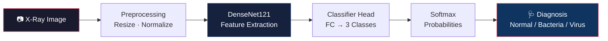
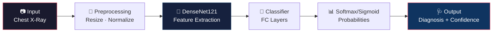

# 🩻 AI X-Ray Assistant

> **Automated Chest X-Ray Pneumonia Detection System** — A production-ready deep learning application that analyzes chest X-rays for pneumonia detection using state-of-the-art DenseNet121 models. Features dual-model support for both **pediatric** (3-class: Normal/Bacteria/Virus) and **adult** (binary: Normal/Pneumonia) populations, with an intuitive web interface powered by Streamlit.


---

## ✨ Key Features

| Feature | Description |
|---------|-------------|
| 🧠 **Dual-Model System** | Pediatric (3-class) + Adult (binary) models for comprehensive coverage |
| 🏥 **Clinical-Grade Architecture** | DenseNet121 pre-trained on ImageNet, fine-tuned on medical datasets |
| 📊 **Pediatric Detection** | 3-class classification: Normal · Bacterial Pneumonia · Viral Pneumonia |
| 🩺 **Adult Detection** | Binary classification: Normal · Pneumonia (RSNA pre-trained) |
| ⚖️ **Class Imbalance Handling** | Weighted Cross-Entropy Loss for fair learning |
| 🔬 **Explainability** | Grad-CAM heatmaps reveal model decision-making process |
| 🛡️ **Data Integrity** | Patient-level splitting prevents train/test contamination |
| 🖥️ **One-Click Launch** | Simple executable or batch script deployment |
| 🚀 **Cross-Platform** | Windows, Linux, and macOS support |
| 📦 **Portable Deployment** | PyInstaller-built standalone executable option |

---

## 🏗️ Architecture



---

## 📈 Model Performance

### Pediatric Model
Trained on the [Kaggle Pediatric Pneumonia Dataset](https://www.kaggle.com/datasets/paultimothymooney/chest-xray-pneumonia) (ages 1–5) with patient-level splitting to prevent data leakage.

| Metric | Value |
|--------|-------|
| **Infection Sensitivity** | 98.6% (only 6/433 sick patients missed) |
| **Normal Classification** | 162/170 correct (95.3%) |
| **Bacteria Detection** | 245/300 correct (81.7%) |
| **Virus Detection** | 110/133 correct (82.7%) |
| **Overall Accuracy** | ~87% on hold-out test set |

**Key Insight:** The model prioritizes **high sensitivity** (catching sick patients) over specificity, making it suitable as a clinical screening tool to minimize false negatives.

### Adult Model
Pre-trained on [RSNA Pneumonia Challenge](https://www.rsna.org/education/ai-resources-and-training/ai-image-challenge/rsna-pneumonia-detection-challenge-2018) adult X-ray dataset using TorchXRayVision.

| Metric | Value |
|--------|-------|
| **Binary Classification** | Pneumonia vs. Normal |
| **Architecture** | DenseNet121 (1-channel grayscale input) |
| **Pre-training** | RSNA adult chest X-rays |

> **Note:** The adult model complements the pediatric model by providing validated performance on adult populations. See [Model Card](docs/MODEL_CARD.md) for detailed metrics.

---

## 🚀 Quick Start

### Prerequisites
- **Python**: 3.10 or higher
- **GPU**: Optional (CPU inference works fine for demo)
- **OS**: Windows, Linux, or macOS
- **Storage**: ~500MB for dependencies + ~50MB per model

### Option 1: One-Click Launch (Recommended)

**Windows:**
```bash
# Double-click this file in File Explorer
run_app.bat
```

**Linux/macOS:**
```bash
chmod +x run_app.sh
./run_app.sh
```

The script automatically creates a virtual environment, installs dependencies, and launches the web app.

### Option 2: Manual Installation

#### 1️⃣ Clone the Repository
```bash
git clone https://github.com/yourusername/AI-XRay-Assistant.git
cd AI-XRay-Assistant
```

#### 2️⃣ Create & Activate Virtual Environment
**Windows:**
```bash
python -m venv venv
venv\Scripts\activate
```

**Linux/macOS:**
```bash
python3 -m venv venv
source venv/bin/activate
```

#### 3️⃣ Install Dependencies
```bash
pip install --upgrade pip
pip install -r requirements.txt
```

#### 4️⃣ Download Model Weights
You need at least one model to run the app:

**Pediatric Model** (3-class):
1. Open [`notebooks/Colab_Model_training.ipynb`](notebooks/Colab_Model_training.ipynb) in [Google Colab](https://colab.research.google.com/)
2. Upload your `kaggle.json` API key
3. Run all cells (uses free T4 GPU)
4. Download `densenet121_pneumonia.pth` → place in `models/` folder

**Adult Model** (binary):
1. Open [`notebooks/NIH_Adult_Training.ipynb`](notebooks/NIH_Adult_Training.ipynb) in Google Colab
2. Run all cells (no GPU needed)
3. Download `densenet121_adult_rsna.pth` → place in `models/` folder

See [`models/README.md`](models/README.md) for detailed instructions.

#### 5️⃣ Launch the Application
```bash
streamlit run app.py
```

The app will open in your browser at `http://localhost:8501` 🎉

---

## 🎯 Usage

1. **Select Model**: Choose between Pediatric or Adult model based on patient age
2. **Upload X-Ray**: Drag and drop or click to upload a chest X-ray image (JPG/PNG)
3. **View Results**: See the diagnosis with confidence scores and detailed probabilities

**Sample Images**: Test the app with images from [`test_images/`](test_images/) folder.

For detailed usage instructions, see [**docs/USAGE.md**](docs/USAGE.md).

---

## 📁 Project Structure

```
AI-XRay-Assistant/
├── 📱 app.py                           # Main Streamlit web application
├── 🚀 run_main.py                      # PyInstaller entry point
├── ⚙️ build_exe.py                     # Executable builder script
├── 🔧 requirements.txt                 # Python dependencies
├── 📜 LICENSE                          # MIT License
├── 📖 README.md                        # This file
├── 🪟 run_app.bat                      # Windows launcher
├── 🐧 run_app.sh                       # Linux/macOS launcher
├── ⚡ launch.bat                       # Alternative Windows launcher
├── 📦 AI_XRay_Assistant.spec          # PyInstaller configuration
│
├── 📂 models/                          # Trained model weights (*.pth files)
│   ├── densenet121_pneumonia.pth      # Pediatric 3-class model
│   ├── densenet121_adult_rsna.pth     # Adult binary model
│   └── README.md                       # Model download instructions
│
├── 📂 notebooks/                       # Google Colab training notebooks
│   ├── Colab_Model_training.ipynb     # Pediatric model training
│   └── NIH_Adult_Training.ipynb       # Adult model setup
│
├── 📂 scripts/                         # Data processing utilities
│   ├── colab_data_setup.py            # Pediatric dataset downloader
│   └── nih_data_setup.py              # Adult dataset helper
│
├── 📂 docs/                            # Comprehensive documentation
│   ├── MODEL_CARD.md                  # ML model specifications
│   ├── PROJECT_STRUCTURE.md           # Detailed file descriptions
│   ├── INSTALLATION.md                # Installation guide
│   ├── USAGE.md                       # Usage instructions
│   ├── TRAINING.md                    # Model training guide
│   ├── DEPLOYMENT.md                  # Deployment options
│   └── CONTRIBUTING.md                # Contribution guidelines
│
├── 📂 test_images/                     # Sample X-ray images for testing
│   ├── Bacteria_and_Virus/            # Pneumonia examples
│   └── Normal/                         # Normal chest X-rays
│
└── 📂 build/                           # PyInstaller build outputs (generated)
    └── AI_XRay_Assistant/

```

See [**docs/PROJECT_STRUCTURE.md**](docs/PROJECT_STRUCTURE.md) for detailed descriptions of each component.

---
## 🛠️ Tech Stack

### Core Technologies
| Component | Technology |
|-----------|------------|
| **Deep Learning** | PyTorch 2.0+, TorchVision |
| **Architecture** | DenseNet121 (Huang et al., 2017) |
| **Medical Imaging** | TorchXRayVision, scikit-image |
| **Web Framework** | Streamlit 1.30+ |
| **Data Processing** | NumPy, Pillow (PIL) |
| **ML Utilities** | scikit-learn, Albumentations |
| **Visualization** | Matplotlib, Seaborn |
| **Optimization** | ONNX Runtime (optional) |
| **Deployment** | PyInstaller (standalone executable) |

### Development Environment
- **Training**: Google Colab (free T4 GPU)
- **Dataset Storage**: Kaggle API integration
- **Version Control**: Git & GitHub
- **Testing**: Manual validation with test images

---

## 🎓 How It Works

### Model Architecture


### Key Techniques
1. **Transfer Learning**: Pre-trained ImageNet weights provide robust feature extraction
2. **Patient-Level Splitting**: Ensures no patient's images appear in both train and test sets
3. **Weighted Loss**: Addresses class imbalance in medical datasets
4. **Grad-CAM**: Visualizes model attention for interpretability
5. **Multi-Model Support**: Separate models for pediatric and adult populations

---

## 📚 Documentation

| Document | Description |
|----------|-------------|
| [**Installation Guide**](docs/INSTALLATION.md) | Detailed setup instructions |
| [**Usage Guide**](docs/USAGE.md) | How to use the web application |
| [**Training Guide**](docs/TRAINING.md) | Train models on your own data |
| [**Deployment Guide**](docs/DEPLOYMENT.md) | Deploy as API, Docker, or executable |
| [**Model Card**](docs/MODEL_CARD.md) | Technical specifications and metrics |
| [**Contributing**](docs/CONTRIBUTING.md) | How to contribute to the project |
| [**Project Structure**](docs/PROJECT_STRUCTURE.md) | Detailed file descriptions |

---

## 🔬 Training Your Own Model

Want to train on custom data or reproduce the results?

1. **Prepare Dataset**: Organize X-rays into labeled folders
2. **Configure Training**: Modify hyperparameters in the Colab notebook
3. **Run Training**: Execute all cells in Google Colab (free GPU)
4. **Evaluate**: Review metrics and confusion matrix
5. **Deploy**: Download `.pth` file and place in `models/` folder

See [**docs/TRAINING.md**](docs/TRAINING.md) for the complete guide.

---

## 📊 Deployment Options

### Option 1: Streamlit Web App (Default)
```bash
streamlit run app.py
```
Best for: Local demos, development, small-scale testing

### Option 2: Standalone Executable
```bash
python build_exe.py
```
Best for: Non-technical users, offline environments, distribution

### Option 3: REST API (Coming Soon)
Deploy as a FastAPI microservice with Docker containerization.

See [**docs/DEPLOYMENT.md**](docs/DEPLOYMENT.md) for detailed instructions.

---

## ⚠️ Important Disclaimers

> **🚨 For Educational and Research Purposes Only**
> 
> This system is **NOT** a certified medical device and should **NOT** be used for:
> - Clinical diagnosis or treatment decisions
> - Patient care without physician oversight
> - Regulatory submission or FDA approval
> - Commercial medical applications
> 
> **Always consult qualified healthcare professionals for medical advice.**

### Known Limitations
- ❌ Not validated on external hospital datasets
- ❌ No multi-pathology detection (only pneumonia)
- ❌ Performance may degrade on poor-quality images
- ❌ Pediatric model only tested on ages 1-5
- ❌ Does not identify specific bacterial/viral strains

See [**docs/MODEL_CARD.md**](docs/MODEL_CARD.md) for comprehensive limitations and ethical considerations.

---

## 🤝 Contributing

Contributions are welcome! Whether it's bug fixes, new features, or documentation improvements:

1. **Fork** the repository
2. **Create** a feature branch (`git checkout -b feature/AmazingFeature`)
3. **Commit** your changes (`git commit -m 'Add some AmazingFeature'`)
4. **Push** to the branch (`git push origin feature/AmazingFeature`)
5. **Open** a Pull Request

See [**docs/CONTRIBUTING.md**](docs/CONTRIBUTING.md) for detailed guidelines.

### Ways to Contribute
- 🐛 Report bugs and issues
- 💡 Suggest new features or improvements
- 📝 Improve documentation
- 🧪 Add test cases
- 🎨 Enhance UI/UX
- 🌍 Add internationalization support

---

## 🙏 Acknowledgments

- **Datasets**:
  - [Pediatric Pneumonia Dataset](https://www.kaggle.com/datasets/paultimothymooney/chest-xray-pneumonia) by Paul Mooney (Kaggle)
  - [RSNA Pneumonia Detection Challenge](https://www.rsna.org/education/ai-resources-and-training/ai-image-challenge/rsna-pneumonia-detection-challenge-2018)
  - [NIH ChestX-ray14 Dataset](https://www.kaggle.com/datasets/nih-chest-xrays/data)

- **Architecture**: DenseNet121 by Huang et al. ([Paper](https://arxiv.org/abs/1608.06993))

- **Frameworks**: PyTorch, Streamlit, TorchXRayVision

- **Inspiration**: Medical AI research community and open-source contributors

---

## 📄 License

This project is licensed under the **MIT License** - see the [LICENSE](LICENSE) file for details.

```
MIT License - Copyright (c) 2026 Muhammad Saad Khan
```

You are free to use, modify, and distribute this software with attribution.

---

## 👤 Author

**Muhammad Saad Khan**

- 🌐 Portfolio: [Your Website]
- 💼 LinkedIn: [Your LinkedIn]
- 🐙 GitHub: [@yourusername](https://github.com/yourusername)
- 📧 Email: your.email@example.com

Built as part of an AI/ML portfolio project demonstrating expertise in:
- Deep Learning for Medical Imaging
- Transfer Learning & Fine-tuning
- Production ML System Design
- Web Application Development
- Model Deployment & Distribution

---

## 📈 Project Stats


---

## 🔮 Future Roadmap

- [ ] **Docker containerization** for easy deployment
- [ ] **REST API** with FastAPI
- [ ] **Batch processing** for multiple images
- [ ] **More pathologies**: Tuberculosis, COVID-19, Lung Cancer
- [ ] **DICOM support** for hospital integration
- [ ] **Cloud deployment** (AWS, GCP, Azure)
- [ ] **Mobile app** version
- [ ] **Real-time inference** optimization
- [ ] **Ensemble models** for improved accuracy
- [ ] **Explainability dashboard** with detailed Grad-CAM analysis

---

## 📞 Support

If you encounter any issues or have questions:

1. **Check Documentation**: Browse [docs/](docs/) folder
2. **Search Issues**: Look for similar [GitHub Issues](https://github.com/yourusername/AI-XRay-Assistant/issues)
3. **Create Issue**: Open a new issue with detailed description
4. **Discussion**: Use [GitHub Discussions](https://github.com/yourusername/AI-XRay-Assistant/discussions) for questions

---

## ⭐ Star History

If you find this project helpful, please consider giving it a star! ⭐

---

<div align="center">

**Made with ❤️ for advancing AI in Healthcare**

[Report Bug](https://github.com/yourusername/AI-XRay-Assistant/issues) · [Request Feature](https://github.com/yourusername/AI-XRay-Assistant/issues) · [View Demo](#)

</div>
