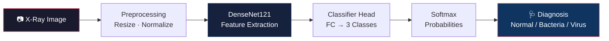

# 🩻 AI X-Ray Assistant

> **Automated Chest X-Ray Pneumonia Detection** — A deep learning system that classifies pediatric chest X-rays into **Normal**, **Bacterial Pneumonia**, or **Viral Pneumonia** using a fine-tuned DenseNet121 model, deployed as a one-click web application.


---

## ✨ Features

| Feature | Description |
|---|---|
| 🧠 **DenseNet121 Backbone** | Pre-trained on ImageNet, fine-tuned for chest X-ray classification |
| 📊 **3-Class Detection** | Normal · Bacterial Pneumonia · Viral Pneumonia |
| ⚖️ **Weighted Loss** | Handles class imbalance with computed class weights |
| 🔬 **Grad-CAM Explainability** | Heatmaps showing where the model is looking |
| 🛡️ **Patient-Level Splitting** | Prevents data leakage between train/val/test sets |
| 🖥️ **One-Click Deployment** | Double-click `run_app.bat` to launch the web app |

---

## 🏗️ Architecture



---

## 📈 Model Performance

Trained on the [Kaggle Pediatric Pneumonia Dataset](https://www.kaggle.com/datasets/paultimothymooney/chest-xray-pneumonia) with patient-level splitting.

| Metric | Value |
|---|---|
| **Infection Sensitivity** | 98.6% |
| **Normal Classification** | 162/170 correct |
| **Bacteria Detection** | 245/300 correct |
| **Virus Detection** | 110/133 correct |

> The model prioritizes **high sensitivity** (catching sick patients) over specificity, making it suitable as a clinical triage tool.

---

## 🚀 Quick Start

### Prerequisites
- Python 3.10+
- A trained model file (`densenet121_pneumonia.pth`)

### 1. Clone & Setup
```bash
git clone <your-repo-url>
cd Zikriya

# Create virtual environment
py -m venv venv
venv\Scripts\activate        # Windows
source venv/bin/activate     # Linux/Mac

# Install dependencies
pip install -r requirements.txt
```

### 2. Train the Model (Google Colab)
1. Open `notebooks/Colab_Model_training.ipynb` in [Google Colab](https://colab.research.google.com/)
2. Upload your `kaggle.json` API key and `colab_data_setup.py`
3. Run all cells — the model will train on a free T4 GPU
4. Download `densenet121_pneumonia.pth` to the project root

### 3. Run the App
**Option A — One Click:**
```
Double-click run_app.bat
```

**Option B — Manual:**
```bash
streamlit run app.py
```

Upload a chest X-ray image and get instant results!

---

## 📁 Project Structure

```
Zikriya/
├── app.py                    # Streamlit web application
├── colab_data_setup.py       # Kaggle data download & patient-level splitting
├── run_app.bat               # One-click Windows launcher
├── run_app.sh                # Bash launcher
├── requirements.txt          # Python dependencies
├── densenet121_pneumonia.pth  # Trained model weights (not in repo)
│
├── src/
│   └── optimize_model.py     # ONNX export & INT8 quantization (optional)
│
├── notebooks/
│   └── Colab_Model_training.ipynb  # Full training pipeline
│
├── docs/
│   ├── MODEL_CARD.md         # ML Model Card
│   └── PROJECT_STRUCTURE.md  # Detailed file descriptions
│
├── models/                   # ONNX model output (optional)
├── data/                     # Raw dataset (not in repo)
└── test_images/              # Sample images for testing
```

---

## 🛠️ Tech Stack

- **Deep Learning:** PyTorch, TorchVision, DenseNet121
- **Data Augmentation:** Albumentations
- **Training:** Google Colab (T4 GPU)
- **Explainability:** Grad-CAM (pytorch-grad-cam)
- **Deployment:** Streamlit
- **Optimization:** ONNX Runtime (optional)

---

## ⚠️ Disclaimer

> This system is intended for **educational and research purposes only**. It is **NOT** a certified medical device and should **NOT** be used for clinical diagnosis. Always consult a qualified healthcare professional.

---

## 📄 License

This project is licensed under the [MIT License](LICENSE).

---

## 👤 Author

**Muhammad Saad Khan** — Built as part of an AI/ML portfolio project.
